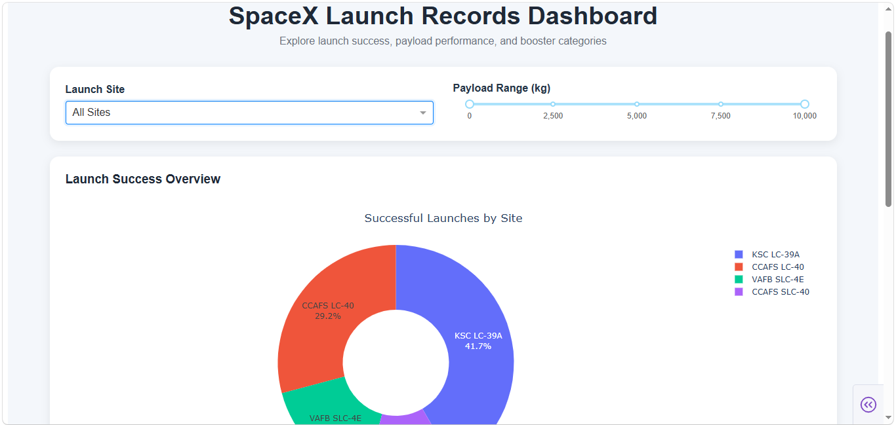
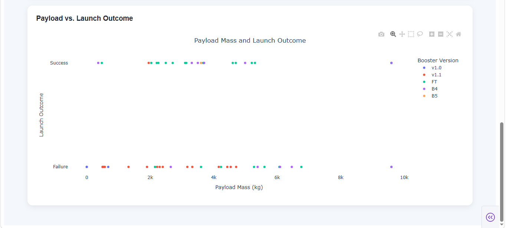

# SpaceX Falcon 9 Landing Prediction

End-to-end data science analysis of SpaceX Falcon 9 launches using API data collection, web scraping, SQL, exploratory analysis, geospatial visualization, interactive dashboards, and machine learning to predict first-stage landing success.

**Best Model:** Decision Tree — 87.5% accuracy  
**Tech:** Python · SQL · Pandas · Beautiful Soup · Folium · Plotly Dash · Scikit-learn

📊 **[View Project Presentation](SpaceX-Falcon9-Data-Science-Presentation.pdf)**

---

## Project Objective

SpaceX's ability to recover and reuse Falcon 9 first-stage boosters plays an important role in reducing launch costs.

This project analyzes historical Falcon 9 launch data to identify factors associated with successful first-stage landings and applies classification models to predict landing outcomes.

The analysis explores questions such as:

- How has landing success changed over time?
- How do launch sites differ in their success rates?
- What relationships exist between payload mass, orbit type, booster version, and landing outcome?
- Can historical mission characteristics be used to classify whether a first stage will successfully land?

---

## Data Collection & Preparation

Launch data was collected from multiple public sources:

- **SpaceX API** for structured launch records
- **Wikipedia** using Beautiful Soup for supplementary Falcon 9 launch information

The resulting dataset contained more than 100 flight records with information including payload mass, orbit, launch site, booster version, flight number, and landing outcome.

The data was then cleaned and prepared for analysis by handling missing values, standardizing fields, transforming landing outcomes into classification labels, and preparing features for exploratory analysis and machine learning.

---

## Exploratory Data Analysis

Exploratory analysis was performed using both **Python and SQL** to investigate relationships among launch characteristics and landing success.

The analysis examined:

- Launch success by year
- Payload mass and landing outcome
- Launch-site performance
- Orbit type and success rate
- Booster version
- Flight number
- Payload statistics and launch records using SQL queries

### Landing Success Over Time

Landing success generally increased over the analyzed period, indicating substantial improvement in Falcon 9 first-stage recovery performance over time.

SQL analysis was also used to query launch records and calculate statistics such as payload averages, launch-site activity, booster performance, and landing outcomes.

---

## Interactive & Geospatial Analysis

### Geospatial Launch Analysis

**Folium** was used to examine the geographic characteristics of SpaceX launch facilities and landing outcomes.

The interactive mapping analysis included:

- SpaceX launch-site locations
- Successful and unsuccessful landing outcomes
- Marker clustering
- Proximity to coastlines
- Nearby highways and railways
- Distance to populated areas

This provided a geographic perspective on launch infrastructure and site placement beyond the statistical analysis.

### Interactive Launch Dashboard

A **Plotly Dash** application was developed to provide interactive exploration of the launch data.

The dashboard enables analysis of:

- Overall launch-site success
- Individual launch-site performance
- Payload ranges
- Successful vs. unsuccessful launches
- Relationships between payload mass and booster version

Interactive filtering allows the launch data to be explored from multiple perspectives rather than relying only on static visualizations.

---

## Machine Learning

The final stage of the project applied classification algorithms to predict whether a Falcon 9 first stage would successfully land.

The modeling workflow included:

- Feature preparation
- Train/test splitting
- Feature standardization
- Model training
- Hyperparameter tuning with `GridSearchCV`
- Accuracy comparison
- Confusion-matrix evaluation

Classification approaches evaluated included:

- Logistic Regression
- Decision Tree
- Support Vector Machine (SVM)
- K-Nearest Neighbors (KNN)

### Best Model

After hyperparameter tuning, the **Decision Tree classifier achieved the highest observed accuracy of 87.5%**.

**Best Decision Tree Parameters:**

| Parameter | Value |
|---|---|
| Criterion | `gini` |
| Max depth | `2` |
| Max features | `sqrt` |
| Min samples leaf | `2` |
| Min samples split | `5` |
| Splitter | `best` |

### Model Evaluation

Confusion matrices were used alongside accuracy scores to examine classification performance and identify incorrect landing predictions.

---

## Key Insights

- Falcon 9 first-stage landing success generally improved over the analyzed period.
- Landing success varied across launch sites, orbit types, payload ranges, and booster configurations.
- KSC LC-39A demonstrated a high landing success rate within the analyzed data.
- Payload mass showed different relationships with landing outcomes depending on launch site and booster configuration.
- Geospatial analysis showed launch facilities positioned near coastlines and transportation infrastructure while maintaining distance from densely populated areas.
- Classification models demonstrated that historical mission characteristics can be used to distinguish between successful and unsuccessful first-stage landing outcomes.
- The tuned Decision Tree produced the highest observed model accuracy at **87.5%**.

---

## Tools & Technologies

### Data Collection & Processing
- Python
- Pandas
- NumPy
- Requests
- Beautiful Soup
- SpaceX REST API

### Data Analysis & Visualization
- SQL
- SQLite
- Matplotlib
- Seaborn
- Plotly
- Folium

### Machine Learning
- Scikit-learn
- Logistic Regression
- Decision Tree
- Support Vector Machine
- K-Nearest Neighbors
- GridSearchCV

### Application Development
- Plotly Dash

### Development Environment
- Jupyter Notebook

---

## Project Background

This project was completed as part of the **IBM Data Science Professional Certificate capstone**.

The project provided hands-on experience applying an end-to-end data science workflow, including acquiring data from APIs and web sources, cleaning and transforming data, querying data with SQL, performing exploratory and geospatial analysis, developing interactive dashboards, and training and evaluating machine learning models.

